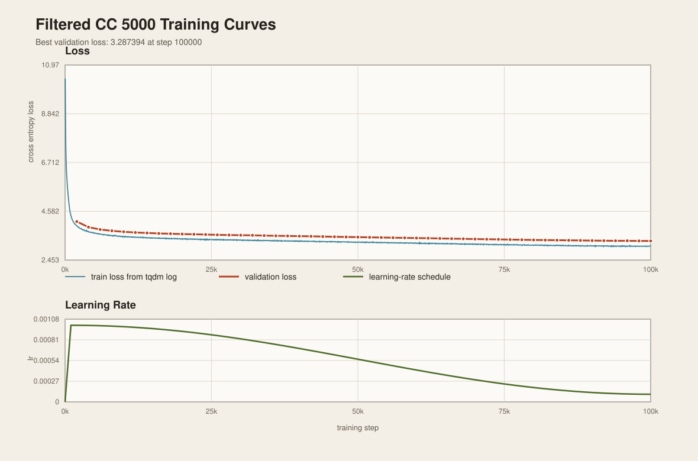

## Problem `look_at_cc`: Looking at the Data (4 points)

### (a)
**Question:** Download the WARC file above, or find the copy we provide on the cluster. Let’s look at the first page in this file. This is a gzipped file, and you can browse its contents with:

`$ zcat /data/CC/example.warc.gz | less`

`less` lets you browse the file using keyboard arrows, Page Up, Page Down. To exit, press “q”.

Look at the very first web page. What is its URL? Is it still accessible? Can you tell what the page seems to be about by looking at the raw HTML?

**Deliverable:** A 2-3 sentence response.

**Answer:** The first web page in the WARC file is `http://0371rykj.com/ipfhsb/34.html`. When it was checked on April 9, 2026, it was still accessible, although it redirected to `http://www.0371rykj.com/ipfhsb/34.html` before returning `200 OK`. From the raw HTML, the page appears to be a Chinese industrial equipment company page, but its title and meta tags look inconsistent with the body content and appear to contain suspicious keyword stuffing, which suggests that the page may be polluted by SEO spam or other low-quality web content.

### (b)
**Question:** Let’s now look at the corresponding WET file:

`$ zcat /data/CC/example.warc.wet.gz | less`

Note that the WET files contain HTTP headers (e.g., Content-Length) that are not part of the extracted text contents. If you look at the first example, you will see that it contains text that was extracted from the raw HTML you just saw.

Notice that much of the extracted text is reminiscent of the HTML structure, and not actually the page’s main content. Are there parts of the text you see that you think should have been filtered out by the extractor? Think about the quality of this text as training data: what might go wrong in training a model on text that looks like this? Conversely, what useful information can a model potentially extract from this page?

**Deliverable:** A 3-4 sentence response.

**Answer:** Yes. The extracted text still contains a lot of content that should likely have been filtered out, including spammy keyword strings at the top, navigation items, contact information, repeated category lists, and footer-like boilerplate such as previous/next links and copyright text. Training on text like this could cause a model to learn low-value webpage templates, keyword stuffing, and repetitive site-specific fragments instead of clean natural language. At the same time, the page still contains some useful information, such as the company name, the product description, and technical specifications for the equipment, which could help the model learn domain-specific vocabulary and factual technical language.

### (c)
**Question:** What makes a good training example is highly contextual. Describe an application domain for which this example might be useful to have in the training data, and one where it might not be.

**Deliverable:** A 1-2 sentence response.

**Answer:** This example could be useful for a domain-specific system focused on Chinese industrial equipment, product catalogs, or technical retrieval, because it contains real company information, product descriptions, and equipment specifications. It would be much less suitable for training a general-purpose user-facing language model, since the page also contains spammy keywords, boilerplate navigation text, and other low-quality web artifacts.

### (d)
**Question:** Let’s look at some more examples to get a better sense of what’s in the Common Crawl. Look through 25 more WET records. For each record, very briefly comment on the document’s language (if you can identify it), the domain name, what type of page it is, etc. How many examples does it take until you see what you’d deem a “high-quality” webpage?

**Deliverable:** Brief annotations of 25 documents with the document’s language, domain, type of page, and any other miscellaneous notes about the document. The number of examples it takes until you see a high-quality example.

**Answer:** The first clearly high-quality webpage appeared at record 2, which is the USNCCM13 conference homepage. Many of the other early examples are dominated by spam, adult content, templated portals, error pages, or low-value navigation-heavy pages, although a few later records are also reasonably high-quality informational pages.

| # | Language | Domain | Page type | Notes |
| --- | --- | --- | --- | --- |
| 1 | Chinese | `10www.chinatikfans.com` | Discuz fan blog / forum page | Mostly login and navigation boilerplate; little substantive content visible in the preview. |
| 2 | English | `13.usnccm.org` | Conference homepage | Clear event information, location, and menu structure; looks like a legitimate informational site. |
| 3 | Chinese | `176.utchat888.com` | Adult video chat portal | Explicit adult gating, rankings, and payment-oriented portal text. |
| 4 | Chinese | `176766.cn` | Spammy company / product page | Starts with explicit spam keywords, then switches into generic company-site navigation. |
| 5 | Chinese | `178mh.com` | Broken template / error page | Only shows a missing-template message, so it has almost no useful textual content. |
| 6 | Chinese | `1796370.tgtg97.com` | Adult cam host profile | Repetitive rankings, pricing, and chat-room boilerplate dominate the page. |
| 7 | Chinese | `18sex.v340.info` | Adult portal landing page | Explicit sexual content plus repeated promotional and ranking text. |
| 8 | Dutch | `1kb.klimtoren.be` | Personal or school blog post | A short blog entry with some boilerplate, but still a recognizable human-written post. |
| 9 | Greek | `1pekesat-exae.mysch.gr` | Helpdesk search page | Mostly forum/search navigation text; low information density in this preview. |
| 10 | Greek | `1pekesat-exae.mysch.gr` | Helpdesk login page | Almost entirely login and site-navigation boilerplate. |
| 11 | Chinese | `1s6605084.yhxzseo.com` | SEO-style content page | Looks like a templated landing page with some readable article text mixed in. |
| 12 | Turkish | `20com20.fr` | Documentation sitemap | Legitimate technical documentation, though it is mainly navigational rather than prose-heavy. |
| 13 | English | `24ktcasino.net` | Casino blog post | Commercial gambling content with blog framing; some natural language but domain is narrow and promotional. |
| 14 | English | `2kgames.eu` | Error page | Just a 404 page, so it is low-value training text. |
| 15 | Chinese | `2l6185919.yizhangting.com` | SEO / entertainment landing page | Templated portal-style page with broad category links and vague promotional text. |
| 16 | Chinese | `303323.com` | Medical device company news page | Legitimate company/news content, but still heavy on navigation and contact boilerplate. |
| 17 | Chinese | `30bad.com` | Streaming / anime aggregator page | Media-index page with synopsis and navigation, not very content-rich. |
| 18 | Chinese | `312001.net` | Hospital / clinic news page | Legitimate institutional site, but the preview is mostly navigation categories rather than article text. |
| 19 | Chinese | `354577.mwe075.com` | Dating / video chat portal | Ranking tables, login prompts, and host-status text dominate the page. |
| 20 | English | `356.schoollibrary.edu.pe.ca` | Library catalog search results page | Legitimate educational site, but this particular page is a noisy no-results catalog query. |
| 21 | Chinese | `366392.haaxz.com` | Adult video portal page | Explicit adult categories and repetitive monetized portal text. |
| 22 | Chinese | `366392.haaxz.com` | Adult video portal page | Near-duplicate of the previous portal page with different host/persona details. |
| 23 | Chinese | `387tel.com` | Video chat / dating portal | Mostly account and ranking UI text, with little substantive prose. |
| 24 | Spanish | `3diasdemarzo.blogspot.com` | News / opinion blog post | Long coherent article text about a specific political issue; comparatively high-quality prose. |
| 25 | Danish | `3godetilbud.dk` | Commercial service landing page | Lead-generation page with short marketing copy and strong call-to-action language. |

High-quality example first appeared at: record 2

---

## Problem `extract_text`: HTML to Text Conversion (3 points)

### (b)
**Question:** Run your text extraction function on a single WARC file. Compare its output to the extracted text in the corresponding WET file. What differences and/or similarities do you notice? Which extraction seems better?

**Deliverable:** 2-3 sentence response comparing and contrasting the text extracted by your own function versus the extracted text in the WET files.

**Answer:** This extraction and the Common Crawl WET output recover much of the same underlying page content, including the product-related text and some of the same spammy or low-quality material. However, this extraction is much noisier: it preserves many HTML-structure artifacts, bullets, and template-like fragments that make the text substantially longer and less readable. For this example, the WET extraction seems better overall, because it is more compact and cleaner, even though it still retains some undesirable boilerplate.

---

## Problem `language_identification`: Language Identification (6 points)

### (a)
**Question:** Write a function that will take a Unicode string and identify the main language that is present in this string. Your function should return a pair, containing an identifier of the language and a score between 0 and 1 representing its confidence in that prediction.

**Deliverable:** A function that performs language identification, giving its top language prediction and a score. Implement the adapter [run_identify_language] and make sure it passes both tests in uv run pytest -k test_identify_language . Note that these tests assume a particular string identifier for English (“en”) and Chinese (“zh”), so your test adapter should perform any applicable re-mapping, if necessary.

**Answer:** The pre-trained fastText `lid.176.bin` language identification model is used. The function returns the top language prediction and its confidence score, with adapter-side label normalization for outputs such as `en` and `zh`.

---

### (b)
**Question:** The behavior of language models at inference time largely depends on the data they were trained on. As a result, issues in the data filtering pipeline can result in problems downstream. What issues do you think could arise from problems in the language identification procedure? In a higher-stakes scenario (such as when deploying a user-facing product), how would you go about mitigating these issues?

**Deliverable:** A 2-5 sentence response.

**Answer:** Errors in language identification can distort the training distribution in both directions: false positives can let non-target-language pages, mixed-language pages, or noisy template text into the dataset, while false negatives can remove useful in-language documents and reduce coverage of important domains or dialects. As a result, the final language model may generate more mixed-language or low-quality text, and it may underperform on legitimate examples that were filtered out too aggressively. In a higher-stakes setting, relying on a single hard language-ID decision alone would be inadvisable; instead, confidence thresholds, manual audits of borderline cases, and additional signals such as document length or character distribution would be combined, while downstream behavior would also be monitored for systematic errors.

### (c)
**Question:** Run your language identification system on text extracted from the WARC files (via your previously-implemented text extraction function). Manually identify the language in 20 random examples and compare your labels with the classifier predictions. Report any classifier errors. What fraction of documents are English? Based on your observations, what would be a suitable classifier confidence threshold to use in filtering?

**Deliverable:** A 2-5 sentence response.

**Answer:** In a manual review of 20 randomly sampled extracted documents, the classifier agreed with the manual labels on 19 of 20 examples. The clearest error was a corrupted PDF-like sample that was predicted as English with low confidence (`0.15`), even though the extracted text was largely non-linguistic garbage rather than clean natural-language content. Overall, `11/20` documents (`55%`) were English. Based on this audit, a confidence threshold around `0.4` seems reasonable: it would remove the obvious failure case while still keeping several correct but noisy boilerplate-heavy pages whose confidence scores were only around `0.47-0.51`.

---

## Problem `mask_pii`: Personal Identifiable Information (3 points)

### (4)
**Question:** What problems do you think might arise downstream in a language model when these filters are naïvely applied on the training set? How might you mitigate these issues?

**Deliverable:** A 2-5 sentence response.

**Answer:** Naive PII masking can fail in both directions: it can miss real sensitive information, but it can also over-mask benign text such as code, configuration strings, example data, or technical documentation that happens to resemble an email address, phone number, or IP address. Excessive masking can also damage useful semantics by replacing information that is important for understanding customer support text, networking tutorials, or contact instructions, and it may cause the model to overproduce artificial placeholder strings. To mitigate these issues, conservative pattern design would be combined with manual audits, false positives and false negatives would be inspected on real web data, and context-aware or document-type-aware rules would be used when possible instead of relying on a single broad regex alone.

### (5)
**Question:** Run your PII masking functions on text extracted from the WARC files (via your previouslyimplemented text extraction function). Look through 20 random examples where a replacement was made; give some examples of false positives and false negatives.

**Deliverable:** A 2-5 sentence response.

**Answer:** In a manual review of 20 sampled documents where at least one replacement occurred, most of the obvious matches were reasonable, but both false positives and false negatives were still observed. The clearest false positive came from a corrupted PDF-like sample, where binary garbage produced strings such as `E@NH.oB` that matched the email regex even though they were not real email addresses. False negatives were also observed for phone numbers: for example, the current pattern missed some non-US or more irregular local formats such as `0577-86809666 86809777`, and it did not consistently capture variants with leading digits such as `0321 4115583`. These examples suggest that regex-based masking is useful as a first pass, but brittle on noisy web text and incomplete across international formatting conventions.

---

## Problem `harmful_content`: Harmful Content (6 points)

### (3)
**Question:** What problems do you think might arise downstream in a language model when these filters are applied to create the training set? How might you mitigate these issues?

**Deliverable:** A 2-5 sentence response.

**Answer:** Harmful-content filtering can fail in both directions: it can miss genuinely toxic or NSFW material, but it can also remove legitimate text that discusses these topics in educational, journalistic, policy, or support contexts. If applied too aggressively, such filtering can distort the training distribution, disproportionately remove some styles or communities, and even make the model worse at recognizing, discussing, or safely responding to harmful content because it has seen too little of it in context. To mitigate this, relying on a single hard classifier decision would be avoided, confidence thresholds would be combined with manual audits of borderline cases, and a distinction would be drawn between text that merely mentions harmful content and text that is itself primarily harmful.

### (4)
**Question:** Run your harmful content filters on text extracted from the WARC files (via your previouslyimplemented text extraction function). Look through 20 random examples and compare the classifier predictions to your own judgments. Report any classifier errors. What fraction of documents are harmful? Based on your observations, what would be suitable classifier confidence threshold(s) to use in filtering?

**Deliverable:** A 2-5 sentence response.

**Answer:** In a manual review of 20 randomly sampled extracted documents, 19 of 20 classifier decisions matched the manual judgment. The clearest error was a likely false negative: an Arabic forum thread describing sexual assault and explicit images was labeled `non-nsfw` and `non-toxic` despite containing clearly disturbing sexual content in context. Across the full scanned sample, the filters marked `277 / 27,201` eligible documents (`1.02%`) as harmful by at least one classifier, so harmful pages appear to be relatively rare in this slice of the crawl. Given that several clearly benign pages still had only moderate non-harmful confidence, conservative filtering thresholds would be appropriate, such as requiring at least about `0.8` confidence for toxic predictions and about `0.9` for NSFW predictions, while manually auditing borderline cases.

---

## Problem `gopher_quality_filters`: Quality Rules (3 points)

### (b)
**Question:** Run your rule-based quality filter on text extracted from the WARC files (via your previouslyimplemented text extraction function). Look through 20 random examples and compare the filter predictions to your own judgment. Comment on any cases where the quality filters differ from your judgments.

**Deliverable:** A 2-5 sentence response.

**Answer:** In a manual review of 20 randomly sampled extracted documents, the Gopher-style rules did catch some clearly low-quality cases, such as a corrupted PDF-like document and an extremely short page consisting mostly of icon names. However, they also passed several pages that would still be considered low-value for language-model training, including a forum registration page, a GitLab topic listing, and a restaurant menu page, because these documents looked formally well-structured even though they were mostly boilerplate or navigation text. The rules also produced a likely false negative on a Chinese novel page, which was rejected mainly because too few tokens contained alphabetic characters; this highlights that the heuristic is biased toward English-like text. Overall, these rules are useful for catching obvious formatting failures, but they are too shallow to reliably separate genuinely high-value prose from templated or multilingual web content.

---

## Problem `filter_data`: Filter Data for Language Modeling (6 points)

### (a)
**Question:** Write a script to filter language modeling data from a collection of Common Crawl WET files (located at /data/CC/CC*.warc.wet.gz on the Together cluster). You are free to apply any of the primitives we’ve implemented in earlier parts of the assignment, and you’re also free to explore other filters and methods for generating data (e.g., filtering based on n-gram language model perplexity). Your goal is to produce data that, when trained on, minimizes the perplexity on the C4 100 domains subset of the Paloma benchmark.

Again, we note that you are allowed to make use of the Paloma validation data in constructing filters or classifiers to process the CC WET files, but are not allowed to literally copy any of the validation data into your training data.

Your script should report the number of examples kept by each filter that you’ve used, so you have a sense of how the filters are contributing to the final output data.

**Deliverable:** A script (or sequence of scripts) that filters the provided CC WET files in parallel to produce language modeling data. A written breakdown of what proportion of the discarded examples are removed by each filter step.

**Answer:** A sequence of scripts was used rather than a single monolithic script. In the self-hosted environment, 5,000 WET files were randomly selected and downloaded from `CC-MAIN-2026-12`; this is the same type of Common Crawl WET input as the handout, but not the pre-mounted Together cluster `/data/CC` path. The stage-1 filter (`scripts/filter_cc_wet_stage1.py`) processed WET records in parallel and applied, in order: English language identification with threshold `0.8`, harmful-content filtering, Gopher-style quality rules, a fastText quality classifier with threshold `0.65`, and PII masking for kept documents. Then `scripts/dedup_stage2.py` performed global exact-line deduplication followed by MinHash near-deduplication, and `scripts/tokenize_filtered_data.py` tokenized the final kept text.

The first-stage document filters saw `96,319,279` WET records and kept `9,080,206` documents (`9.43%`). Among the `87,239,073` records discarded in stage 1, the language filter removed the largest share: `76,316,102` records, or `87.48%` of the stage-1 discards. The quality classifier removed `8,181,266` records (`9.38%` of stage-1 discards), the Gopher rules removed `2,699,978` records (`3.09%`), harmful-content filtering removed `41,702` records (`0.048%`), and `25` records were empty after stripping. PII masking did not discard documents, but it modified `3,081,461` kept documents, which is `33.94%` of the stage-1 kept set.

The deduplication stage then processed the `9,080,206` stage-1 kept documents. Exact-line deduplication indexed `1,304,532,231` line instances and removed `1,054,738,707` repeated line instances (`80.85%` of line instances); after this line removal, `452,581` documents became empty and were discarded. MinHash deduplication generated `132,904` candidate duplicate pairs, confirmed `15,287` duplicate pairs, and removed `6,355` additional documents. The final filtered dataset contains `8,621,270` documents, or `8.95%` of the original WET records.

### (b)
**Question:** How long does it take to filter the 5,000 WET files? How long would it take to filter the entire Common Crawl dump (100,000 WETs)?

**Deliverable:** Runtime of the data filtering pipeline.

**Answer:** Excluding Common Crawl download time, filtering the 5,000 WET files took about `33,688.90` seconds, or `9.36` hours, on the self-hosted server. Stage 1, which applied the document-level WET filters bucket by bucket with `24` workers, took `13,203.16` seconds (`3.67` hours) of summed bucket filtering time. Stage 2, which performed global exact-line deduplication and MinHash/LSH near-deduplication, took `20,485.74` seconds (`5.69` hours) with `40` workers. The stage-2 runtime was dominated by MinHash signature preprocessing, which took `17,672.26` seconds (`4.91` hours); LSH candidate generation took another `1,484.43` seconds (`0.41` hours), while the remaining exact-dedup and write-back phases were much smaller.

A simple linear extrapolation from `5,000` to `100,000` WET files multiplies the observed filtering time by `20`, giving about `187.16` hours, or `7.80` days, on similar hardware with the same staged pipeline. This is treated as an order-of-magnitude estimate rather than a guaranteed wall-clock schedule, because the self-hosted download time is network-dependent and not included here, and because larger runs may shift the bottleneck between CPU, memory, and disk I/O.

---

## Problem `inspect_filtered_data`: Inspect Filtered Data (4 points)

### (a)
**Question:** Take five random examples from your filtered dataset. Comment on their quality and whether or not they’d be suitable for language modeling, especially given that our goal is to minimize perplexity on the C4 100 domains benchmark.

**Deliverable:** Five random examples from the final filtered data. Only showing pertinent excerpts of the data is fine, since the documents may be lengthy. For each example, a 1-2 sentence description of the example and whether or not it’s worthwhile to use for language modeling.

**Answer:** Five examples were sampled from the final stage-2 deduplicated dataset using seed `336`. Overall, the sample suggests that the filtered dataset contains several useful long-form or semi-long-form English documents, but it still admits some web boilerplate and commercial navigation text.

| Example | Excerpt | Description | Worth keeping? |
| --- | --- | --- | --- |
| 1 | `Exodus 20:22 ... Bible Commentary` | A Bible verse page with parallel translations and commentary. It is fluent English, but it is repetitive and domain-specific. | Borderline yes: useful as clean English text, but less representative of broad C4-style web domains. |
| 2 | `Manyavar Store in Kankurgachi ... Choose your Shipping Country` | An e-commerce/store page dominated by menus, product categories, and shipping/navigation text. | Mostly no: this is the clearest kept-sample failure, since it is mostly boilerplate rather than natural prose. |
| 3 | `Massachusetts Man Found Guilty ... Capitol Breach` | A news/legal article about a Capitol breach case, with coherent factual prose. | Yes: this is the kind of article-like web text that should help broad-domain language modeling. |
| 4 | `Tips for Hiring Your First Employee` | A business/entrepreneurship tag page containing short article summaries about hiring and performance reviews. | Yes, with caveats: it has some index-page structure, but the retained text is mostly readable topical prose. |
| 5 | `John Hendricks ... co-founded Strike Source` | A biographical page with coherent sentences about a media/news figure and related work. | Yes: this is relatively clean English prose and seems suitable for language modeling. |

### (b)
**Question:** Take five CC WETs that were removed and/or modified by your filtering script. What part of your filtering process removed or modified these documents, and do you think that their removal and/or modification was justified?

**Deliverable:** Five random discarded examples from the original WETs. Only showing pertinent excerpts of the data is fine, since the documents may be lengthy. For each example, a 1-2 sentence description of the example and whether or not its removal was justified.

**Answer:** The five sampled removed/modified examples from the review logs were all dropped by stage-2 exact-line deduplication with reason `exact_line_dedup_empty`: after globally repeated lines were removed, no useful unique text remained. This makes the examples especially helpful for checking whether exact-line dedup is removing boilerplate rather than discarding unique prose.

| Example | Excerpt | Removed/modified by | Was it justified? |
| --- | --- | --- | --- |
| 1 | `Diversity Equity Inclusion Belonging Archives ... About Overview` | `exact_line_dedup_empty` | Yes. The page is mostly repeated school navigation, portals, calendars, and menu boilerplate, so dropping it should improve the training set. |
| 2 | `Introducing Manulife InvestChoice ... Our funds` | `exact_line_dedup_empty` | Yes. The sampled text is dominated by fund-site navigation, login prompts, role selectors, and repeated headings rather than article content. |
| 3 | `Default Web Site Page ... SORRY!` | `exact_line_dedup_empty`; the PII masker also replaced an email address with `\|\|\|EMAIL_ADDRESS\|\|\|` before the final drop. | Yes. This is a generic cPanel default page and not useful natural web content for the target benchmark. |
| 4 | `cybersecuritysymposium.com is for sale` | `exact_line_dedup_empty`; the PII masker also replaced a phone number with `\|\|\|PHONE_NUMBER\|\|\|` before the final drop. | Yes. It is a parked-domain sales page with prices, transaction boilerplate, and support text. |
| 5 | `Mansur – male gyrfalcon ... Sponsorship Bronze` | `exact_line_dedup_empty` | Mostly yes, but this is the most borderline removal. It includes a little animal-description prose, but the page is mixed with sponsorship/product-template text and was not unique after exact-line deduplication. |

### (c)
**Question:** If your analysis above motivates further changes to your data pipeline, feel free to make those changes before training your model. Report any changes and/or iterations of data that you experimented with.

**Deliverable:** A description of data changes and/or iterations that you experimented with.

**Answer:** This inspection did not motivate a final change to the filtering thresholds or deduplication semantics. The kept Manyavar store page shows that some e-commerce and navigation boilerplate still leaks through, so a future iteration could add a stronger navigation/catalog-page filter or domain/template heuristic. However, changing the final pipeline at this point would also risk removing legitimate short article index pages such as the business-blog sample, and the removed examples suggest that exact-line deduplication is already catching many highly templated pages.

Therefore, the final data pipeline was kept unchanged after this inspection. The main iterations made for the final run were systems-level and semantics-preserving: improving the stage-2 deduplication storage lifecycle, adding an exact-checkpoint resume path, and verifying with a 50-WET A/B check that the optimized implementation matched the older stage-2 behavior.

---

## Problem `tokenize_data`: Tokenize Data (2 points)

### Token count
**Question:** Write a script to tokenize and serialize your filtered data. Make sure to serialize following the example code above, with ids_array.tofile(output_path), where ids_array is a np.uint16 numpy array of integer IDs. This ensures compatibility with the provided training script.

How many tokens are in your filtered dataset?

**Deliverable:** A script to tokenize and serialize your filtered data, and the number of tokens in your produced dataset.

**Answer:** The script `scripts/tokenize_filtered_data.py` was used to tokenize the final stage-2 deduplicated JSONL files with the GPT-2 tokenizer. The script reads the `text` field from each document, tokenizes in batches of `256`, appends the GPT-2 EOS token (`50256`) after each document, and serializes the resulting token stream as a `uint16` binary file. This is safe for GPT-2 because the tokenizer length is `50,257`, so every token id fits in `uint16`.

The final tokenized dataset contains `8,621,270` documents and `9,125,412,810` tokens. The serialized output was written to `filtered_train_gpt2.bin` with size `18,250,825,620` bytes (`17.00` GiB), and the tokenization run took `6,341.76` seconds (`1.76` hours).

---

## Problem `train_model`: Train Model (2 points)

### Training result
**Question:** Train a language model (GPT-2 small-shaped) on your tokenized dataset. Periodically measure the validation loss on C4 100 domains (this is already enabled by default in the config at cs336-basics/cs336_basics/train_config.py). What is the best validation loss that your model achieves? Submit this value to the leaderboard.

**Deliverable:** The best validation loss that was recorded, the associated learning curve, and a description of what you did.

**Answer:** The provided GPT-2-small-shaped model was trained using `cs336-basics/scripts/train.py` on the final GPT-2-tokenized filtered Common Crawl dataset. The current assignment code default of `100,000` training steps was used, which follows the `1.0.4` changelog update that halved the leaderboard training tokens from the older `200,000`-step handout text. The run used `2` H800 GPUs with PyTorch DDP, `train_batch_size=128` per device, `eval_interval=2000`, `eval_iterations=1000`, `bfloat16` autocast, `torch.compile=True`, and the provided cosine learning-rate schedule with `lr=1e-3`, `min_lr=1e-4`, and `warmup_ratio=0.01`.

The run completed successfully in about `10h 26m`, from `2026-04-12T21:33:49+08:00` to `2026-04-13T08:00:14+08:00`. The best validation loss was `3.2873942852020264`, achieved at the final step, `100000`. The final model checkpoint was written outside the repository in the run's model-output directory, but it is not archived in the repository because it is a large generated artifact (`619M`).

The full validation-loss curve is archived in `artifacts/experiments/ch4/training_run/validation_curve.json` and `artifacts/experiments/ch4/training_run/validation_curve.md`. A compact view of the curve is:

| Step | Validation loss |
| --- | --- |
| 2,000 | 4.133134365081787 |
| 10,000 | 3.6869091987609863 |
| 20,000 | 3.587442636489868 |
| 40,000 | 3.495964527130127 |
| 60,000 | 3.412804126739502 |
| 80,000 | 3.3297276496887207 |
| 90,000 | 3.3013429641723633 |
| 94,000 | 3.2927300930023193 |
| 96,000 | 3.2933316230773926 |
| 98,000 | 3.2879934310913086 |
| 100,000 | 3.2873942852020264 |

The training loss and validation loss both continued improving through the end of training. The validation curve had a small fluctuation around step `96000`, but the final step still gave the best validation loss. The lightweight evidence for this run, including the plotted curve, parsed validation curve, run metadata, final status, and training-log tail, is archived under `artifacts/experiments/ch4/training_run/`.
